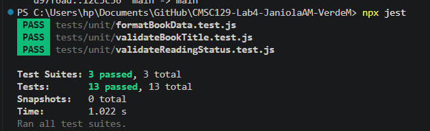
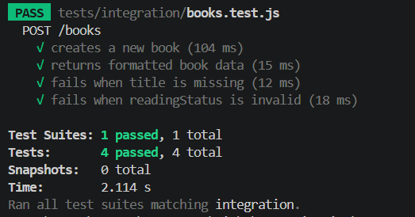
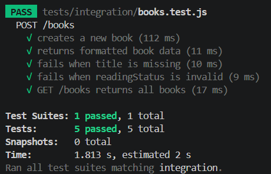
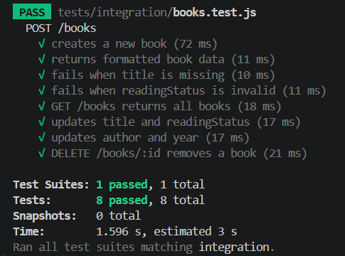

# 📚 Reading List

- CMSC 129 Lab 4 Activity - Test-Driven Development


## Members
- Angel May Janiola
- Myra Verde

### Deployment Link
- [to insert]


## App Description

This is an application that allows users to manage their books using CRUD. With this app, users can view their book collection, add books to their reading list, update its reading status and other necessary information, and remove books from their reading list.

---

# User Stories

1. As a reader, I want to add books to my reading list so that I can track what I am reading.

2. As a reader, I want to update a book's reading status so that I can monitor my reading progress.

3. As a reader, I want to remove books that I do not want from my reading list so that I can keep my list organize.
---

# Tech Stack

## Frontend
- React (Vite)

## Backend
- Node.js with Express

## Testing Tools
- Jest
- React Testing Library
- Supertest
- Playwright

## Data Storage
- In-memory JavaScript array

---

# Testing Strategy

## Unit Testing

- validate book titles
- validate allowed reading statuses
- format book data

---

## Integration Testing

- create books through POST requests
- retrieve books through GET requests
- validate invalid request payloads

---

## System / E2E Testing

- add a new book
- update a book's reading status
- delete a book from the list

---

# Setup Instructions

## Clone Repository

```bash
git clone https://github.com/hungrychef-bytescode/CMSC129-Lab4-JaniolaAM-VerdeM.git 
cd CMSC129-Lab4-JaniolaAM-VerdeM
```

---

## Install Frontend Dependencies

```bash
cd client
npm install
```

---

## Install Backend Dependencies

```bash
cd ../server
npm install
```

---

## Run Frontend

```bash
cd client
npm run dev
```

---

## Run Backend

```bash
cd server
npm run dev
```

---

## Run Tests

### Unit Tests
```bash
npm run test:unit
```

### Integration Tests
```bash
npm run test:integration
```

### System Tests
```bash
npx playwright test
```

---

# Test Results

## Unit Tests

- validate book title


- validate reading status


- format book data


---

## Integration Tests

---

- create a new book (POST /books)



- retrieve books (GET /books)



- update (PUT /books/:id) and delete a book (DELETE /books/:id)




## System Tests


---

## Reflection

Writing tests before code was challenging at first because we were used to
building features first and testing them after. The most difficult part was
writing tests for code that did not exist yet — it felt unnatural to assert
behavior on something with no implementation.

The most frustrating challenge we encountered was configuring Playwright to
run in CI. The tests passed perfectly on our local machine but kept failing
in GitHub Actions. It tested our patience pushing fix after fix, but it taught
us something important: a test that only works locally is not a real test.
Getting it to finally pass on CI felt very rewarding.

Writing tests first did change how we designed our code. Because we had to
think about what a function should return before writing it, we ended up with
cleaner, more focused functions. Our validation functions became pure and simple
because the tests demanded clear inputs and outputs. The tests also gave us
confidence when refactoring — we could restructure code without worrying about
breaking behavior since the tests would catch it immediately.

---

# CI/CD Setup

## Tool Used
GitHub Actions

## Trigger
Tests run automatically on every push to `main`.

## Pipeline Screenshots

### Failing pipeline run (Red phase)
[to insert screenshot]

### Passing pipeline run (Green phase)
[to insert screenshot]