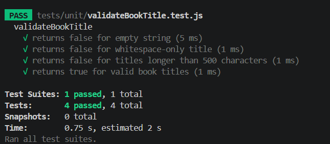
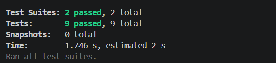

# 📚 Reading List

- CMSC 129 Lab 4 Activity - Test-Driven Development


## Members
- Angel Mae Janiola
- Myra Verde

### Deployment Link
- [to insert]


## App Description

This is an application that allows users to manage their books using CRUD. With this app, users can view their book collection, add books to their reading list, update its reading status and other necessary information, and remove books from their reading list.

---

# User Stories

1. As a reader, I want to add books to my reading list so that I can track what I am reading.

2. As a reader, I want to update a book’s reading status so that I can monitor my reading progress.

3. As a reader, I want to remove books that I do not want from my reading list so that I can keep my list organize.
---

# Tech Stack

## Frontend
- React (Vite)

## Backend
- Node.js with Express

## Testing Tools
- Jest
- React Testing Library
- Supertest
- Playwright

## Data Storage
- In-memory JavaScript array

---

# Testing Strategy

## Unit Testing

- validate book titles
- validate allowed reading statuses
- formatt book data

---

## Integration Testing

- create books through POST requests
- retrieve books through GET requests
- validate invalid request payloads

---

## System / E2E Testing

- add a new book
- update a book’s reading status
- delete a book from the list

---

# Setup Instructions

## Clone Repository

```bash
git clone https://github.com/hungrychef-bytescode/CMSC129-Lab4-JaniolaAM-VerdeM.git 
cd CMSC129-Lab4-JaniolaAM-VerdeM
```

---

## Install Frontend Dependencies

```bash
cd client
npm install
```

---

## Install Backend Dependencies

```bash
cd ../server
npm install
```

---

## Run Frontend

```bash
cd client
npm run dev
```

---

## Run Backend

```bash
cd server
npm run dev
```

---

## Run Tests

---

---

# Test Results

## Unit Tests

- validate book title



- validate reading status


---

## Integration Tests

---

## System Tests

---

# CI/CD Setup